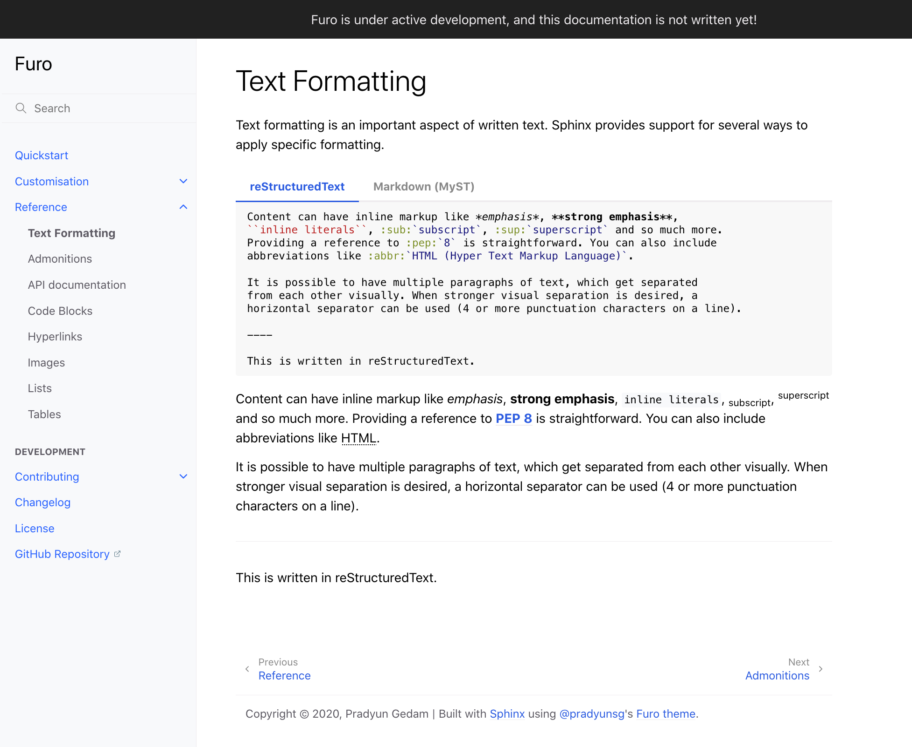

# Furo

A clean customizable theme for [Sphinx](https://www.sphinx-doc.org/).

<a href="https://pradyunsg.me/furo/">
  
</a>

## Quickstart

Furo can be installed using `pip`:

```
pip install furo
```

Update the `html_theme` in `conf.py`:

```py
html_theme = "furo"
```

Your Sphinx documentation will now be generated with this theme! For more information, visit [Furo's documentation][docs].

[docs]: https://pradyunsg.me/furo/

## Contributing

Furo is a volunteer maintained open source project, and we welcome contributions of all forms. Please take a look at our [Contributing Guide](https://pradyunsg.me/furo/contributing/) for more information.

## Acknowledgements

Furo is inspired by (and borrows elements from) some excellent technical documentation themes:

- [mkdocs-material] for MkDocs
- [Just the Docs] for Jekyll
- [GitBook]

We use [BrowserStack] to test on real devices and browsers. Shoutout to them for supporting OSS projects!

[mkdocs-material]: https://squidfunk.github.io/mkdocs-material/
[Just the Docs]: https://pmarsceill.github.io/just-the-docs/
[GitBook]: https://www.gitbook.com/
[BrowserStack]: https://browserstack.com/

## License

This project is licensed under the MIT License.
